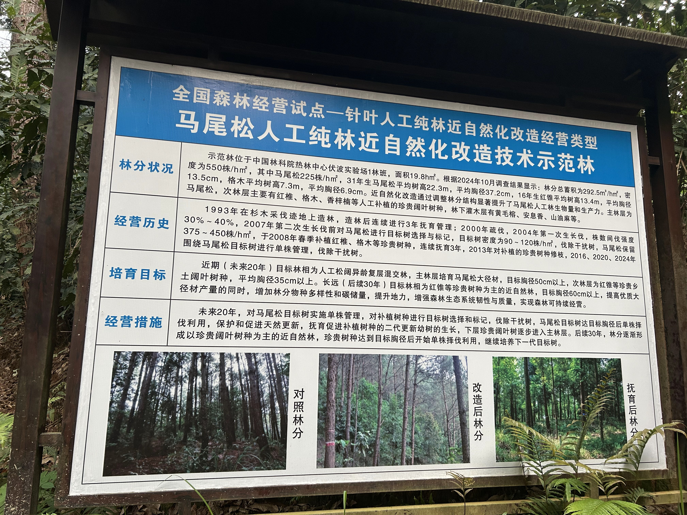
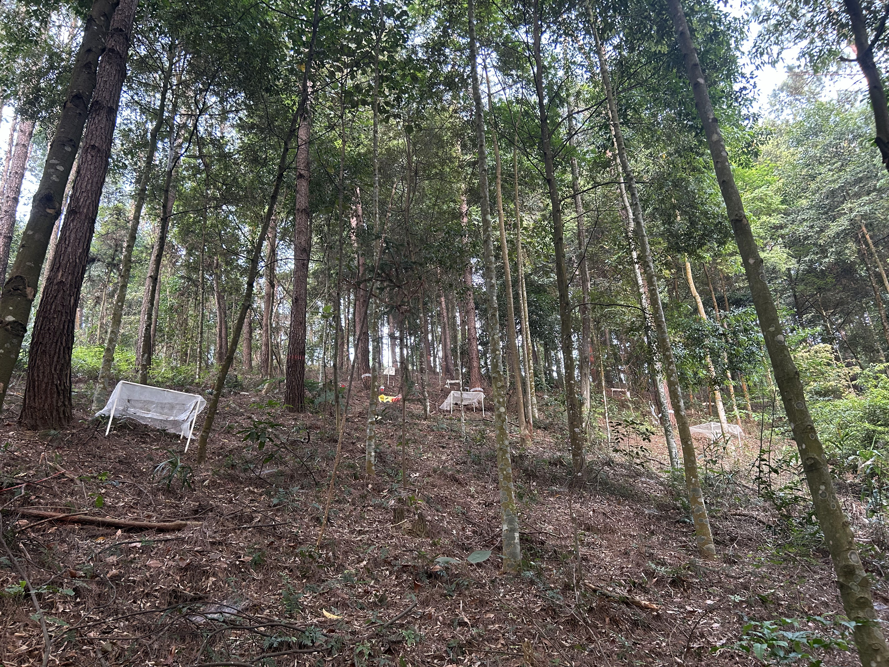
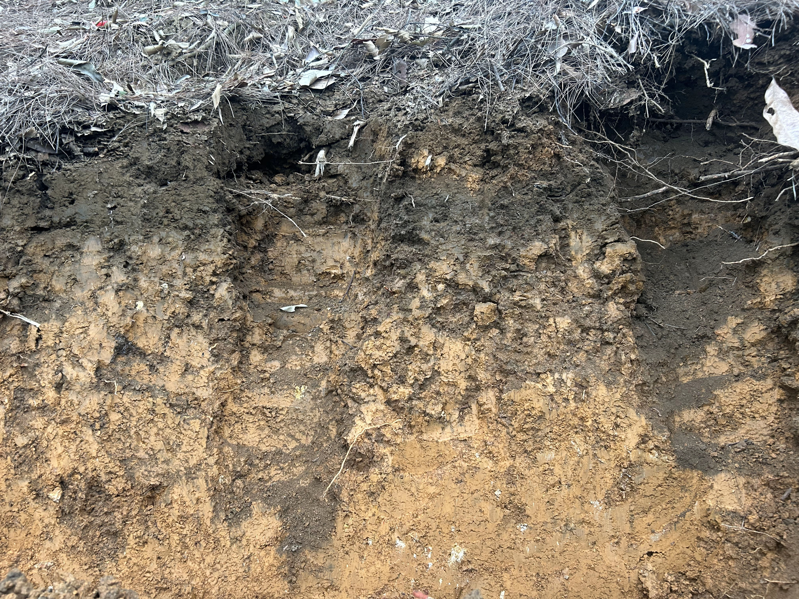

2026年4月4日至7日，广西大学刘华清老师带领研究团队前往广西壮族自治区凭祥市，对多树种混交实验样地进行了为期4天的土壤调查与样品采集工作。

## 样地概况

凭祥多树种混交实验样地由中国林业科学研究院热带林业研究中心建立，广西大学研究团队在此基础上进行了样方划定和样地调查工作。该样地位于广西壮族自治区凭祥市境内，旨在研究不同树种混交模式对土壤理化性质、微生物群落及生态系统功能的影响，本团队同时关注混交林对水分和碳素运移的影响。样地内种植有多种乡土树种和经济树种，为开展森林土壤生态学研究提供了理想的试验平台。

## 调查内容

本次野外调查工作主要包括土壤样品采集和样地维护两个方面。

### 土壤样品采集

团队成员按照标准化采样方案，在样地内不同树种混交区域进行了系统的土壤剖面挖掘和样品采集。采集的土壤样品将用于分析土壤物理结构、化学性质以及微生物群落组成，为后续研究提供基础数据支撑。

### 样地维护

调查期间，团队还对样地的标识牌、围栏等设施进行了检查和维护，确保样地长期监测工作的顺利开展。全体成员分工协作，高效完成了各项野外调查任务。

## 后续工作

目前，采集的土壤样品已安全运回实验室。团队将开展系统的实验室分析工作，包括土壤物理性质测定、化学指标分析、微生物群落测序等。相关研究成果将为揭示多树种混交林土壤生态过程提供科学依据，并为区域森林经营管理提供理论支撑。

此次野外调查工作得到了中国林业科学研究院热带林业研究中心的大力支持和协助。
